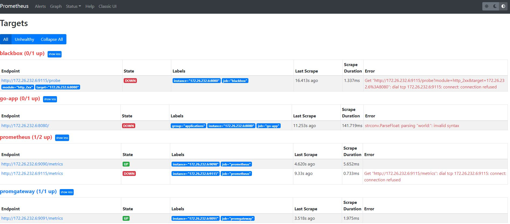
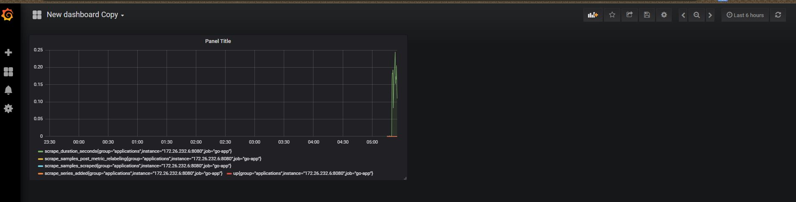

# Devops Test

### Preparation
1. Rename file .env and change IP address
2. Add IP from Vault or change in the file _prometheus/prometheus.yml_

### Run monitoring resources
1. We need to create infrastructure with to commands  
Create __Prometheus__, __Prometheus gateway__, __Grafana__
~~~
# sudo docker-compose -f gocker-compose.yml up -d
~~~
Create __Go application__
~~~
# sudo docker-compose -f go-compose.yml up -d
~~~

2. Check installation  
__Prometheus__ {IP address}:9090  
__Prometheus gateway__ {IP address}:9091  
__Grafana__ {IP address}:3000 
__Go application__ {IP address}:8080

3. Check targets  
Go to __Prometheus -> targets__  
```State = UP``` - it is normal  
For __Go application__  ```State = Down``` - also normal, if error ```strconv.ParseFloat: parsing "world:": invalid syntax```  



4. Check __Prometheus pushgatway__
Sent from console of PC  
~~~
echo -e 'job_successful 100.0\njob_failed 0.0' | curl --data-binary @-  http://localhost:9091/metrics/job/go_app_job
~~~

5. Grafana  




### P.S. What next?

We could proceed to add blackbox for the monitoring of the web (like Go application too)  
Can add alertmanager and setup Jenkins for starting of jobs for a schedule. We could add at this job some variables which send to the pushgateway info about application status, failes and a start/end time of job
